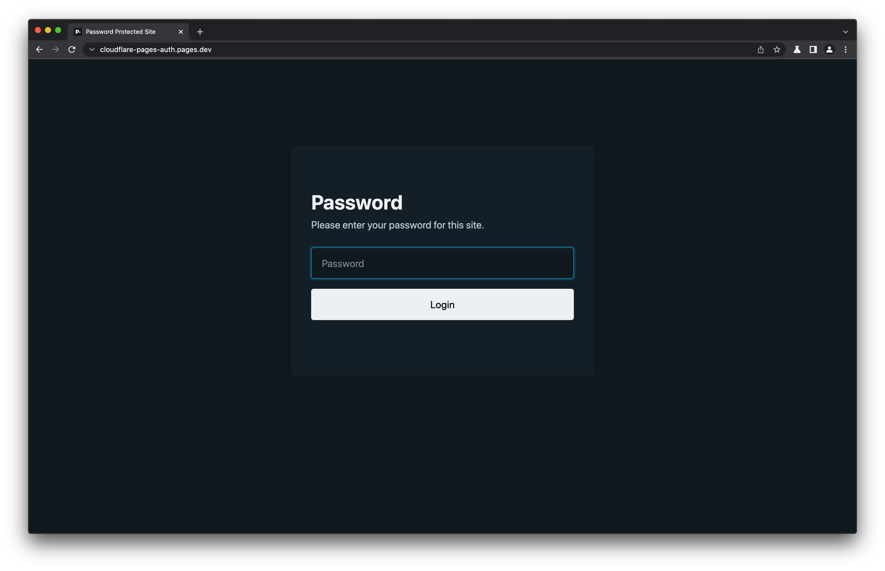

# cloudflare-pages-auth

Static site that is password-protected when deployed to Cloudflare Pages. This is a SvelteKit project, but the password-protection works independently of the framework you use.



## 🚀 Getting Started

If you want to password-protect your own Cloudflare Pages site, you'll need to:

1. Copy the contents of the `functions` directory from this repo into your own project.
2. Add a `CFP_PASSWORD` environment variable to your Cloudflare Pages dashboard with the password you want to use.

The next time you deploy your site, it will be password-protected! 🎉

> ⚠️ Note: You might want to update your Cloudflare project settings to be "[Failed closed](https://developers.cloudflare.com/pages/functions/pricing/#fail-closed)". Otherwise, your site will be unprotected if you reach your daily limit of Function requests. Thanks Thomas for letting me know about this!

## 🛠 Running Locally

Since this is a SvelteKit project, first run the build command to generate the static site:

```bash
npm run build
```

Then, you'll need to use the [wrangler](https://github.com/cloudflare/wrangler2) CLI to run the site (with functions) locally:

```bash
npx wrangler pages dev build -b CFP_PASSWORD=test
```

Notice that you'll need to pass the `CFP_PASSWORD` environment variable when running the CLI command. If you don't pass it, the site will not be password-protected.

## 💅 Customization

- The `functions/template.ts` file contains the HTML template of the login page. You can customize it to your liking.
- The `functions/constants.ts` contains some other things you can customize, like the expiration of the auth cookie, or the list of paths that don't require authentication.
